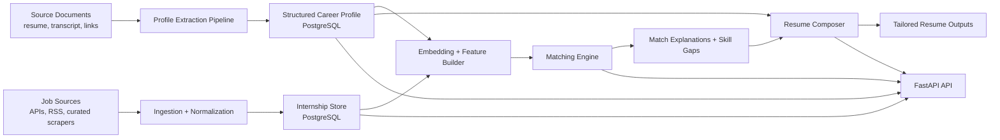

# CareerOS Architecture

## 1. System Overview

CareerOS should be implemented as a modular monolith with containerized deployment.

The architecture is organized around five core capabilities:

1. Profile Intelligence
2. Opportunity Ingestion
3. Matching and Ranking
4. Resume Tailoring
5. Orchestration and Observability



## 2. Architecture Principles

### 2.1 Source Of Truth

Structured relational profile data is the source of truth. Generated artifacts are projections of this data.

### 2.2 Verification Gate

Only verified facts may be used in tailored resume outputs.

### 2.3 Modular Monolith

The codebase remains one deployable application package, but internal boundaries are explicit and domain-oriented.

### 2.4 Local-First AI

Embeddings and summarization should prefer local execution when feasible. Remote providers should be optional adapters, not hard dependencies.

### 2.5 Hybrid Intelligence

Matching should combine deterministic rules with embeddings rather than relying on opaque vector similarity alone.

## 3. Logical Components

### 3.1 Profile Intelligence Module

Responsibilities:

- Import resume PDFs and other source documents
- Extract text and metadata
- Convert extracted information into structured candidate facts
- Store verification state and evidence linkage
- Maintain the canonical career profile

Key submodules:

- `documents`: raw file handling and text extraction
- `profile_parser`: LLM-assisted or rules-assisted extraction
- `profile_service`: profile CRUD and validation
- `verification_service`: user approval workflow for extracted facts

### 3.2 Opportunity Ingestion Module

Responsibilities:

- Collect internship postings from trusted sources
- Normalize posting structure
- Deduplicate similar or repeated listings
- Track source provenance and refresh status

Key submodules:

- `source_registry`: source definitions and adapters
- `collectors`: API, RSS, or HTML adapters
- `normalizer`: canonical schema mapping
- `deduper`: duplicate detection by URL, content hash, and fuzzy title/company/location matching

### 3.3 Matching And Ranking Module

Responsibilities:

- Build profile and job features
- Generate embeddings
- Score internship fit
- Persist score breakdowns
- Produce user-readable explanations
- Identify missing skills

Scoring approach:

- Hard filters for basic eligibility and preference fit
- Deterministic feature scoring
- Embedding similarity scoring
- Gap penalties
- Weighted aggregate ranking

### 3.4 Resume Tailoring Module

Responsibilities:

- Select verified facts relevant to a target role
- Assemble resume sections from templates
- Preserve factual integrity
- Export PDF and HTML artifacts
- Store traceability metadata for every generated bullet and section

### 3.5 Orchestration And Observability Module

Responsibilities:

- Run scheduled ingestion jobs
- Process asynchronous extraction and embedding tasks
- Track job runs and failures
- Emit logs and metrics

This should remain lightweight in MVP by using PostgreSQL-backed task tracking instead of introducing Redis or a message broker.

## 4. Recommended Repository Structure

```text
CareerOS/
├── docs/
│   ├── PROJECT_CONTEXT.md
│   ├── ARCHITECTURE.md
│   ├── ROADMAP.md
│   └── DECISIONS.md
├── src/
│   └── careeros/
│       ├── api/
│       │   ├── main.py
│       │   ├── deps.py
│       │   └── routes/
│       │       ├── health.py
│       │       ├── profile.py
│       │       ├── jobs.py
│       │       ├── matches.py
│       │       ├── resumes.py
│       │       └── admin.py
│       ├── core/
│       │   ├── config.py
│       │   ├── logging.py
│       │   ├── security.py
│       │   └── enums.py
│       ├── db/
│       │   ├── base.py
│       │   ├── session.py
│       │   ├── models/
│       │   └── migrations/
│       ├── domain/
│       │   ├── profiles/
│       │   ├── internships/
│       │   ├── matching/
│       │   ├── resumes/
│       │   └── tasks/
│       ├── services/
│       │   ├── ai/
│       │   │   ├── embeddings.py
│       │   │   ├── llm.py
│       │   │   ├── prompts/
│       │   │   └── providers/
│       │   ├── documents/
│       │   ├── ingestion/
│       │   ├── matching/
│       │   ├── profiles/
│       │   └── resumes/
│       ├── workers/
│       │   ├── main.py
│       │   ├── scheduler.py
│       │   └── handlers/
│       ├── templates/
│       │   ├── resumes/
│       │   └── prompts/
│       └── utils/
├── tests/
│   ├── unit/
│   ├── integration/
│   └── fixtures/
├── scripts/
│   ├── bootstrap.sh
│   ├── seed_dev_data.py
│   └── reindex_embeddings.py
├── data/
│   ├── incoming/
│   ├── processed/
│   └── exports/
├── infra/
│   ├── docker/
│   │   ├── api.Dockerfile
│   │   └── worker.Dockerfile
│   └── postgres/
│       └── init.sql
├── pyproject.toml
├── docker-compose.yml
├── alembic.ini
├── .env.example
├── Makefile
└── README.md
```

### Repository Structure Notes

- `domain/` contains business entities and pure domain logic
- `services/` contains orchestration and integration logic
- `api/` exposes transport concerns only
- `workers/` runs background tasks using the same codebase as the API
- `templates/` contains deterministic resume and prompt templates
- `data/` is a local working directory for inputs and generated artifacts

## 5. Container Architecture

### 5.1 Containers

The recommended Docker Compose topology is:

1. `api`
2. `worker`
3. `db`
4. `ollama` optional

### 5.2 Service Responsibilities

### `api`

- Runs FastAPI with Uvicorn
- Exposes HTTP endpoints
- Handles synchronous validation and retrieval
- Creates background task records for heavier work

### `worker`

- Runs scheduled and asynchronous jobs
- Processes document parsing, ingestion, embedding generation, and match recomputation
- Shares the same application package as `api`

### `db`

- PostgreSQL with `pgvector`
- Stores canonical application state
- Stores embeddings, tasks, runs, and artifacts metadata

### `ollama` optional

- Hosts local generation and embedding models
- Can be disabled if using in-process sentence-transformers or a remote provider

### 5.3 Deployment Pattern

The API and worker should use the same image or near-identical images. This keeps dependency drift low and preserves a monolithic operational model.

### 5.4 Volumes

Recommended local volumes:

- Postgres data volume
- `data/incoming` for uploaded source files
- `data/exports` for generated resume outputs
- Optional Ollama model cache

### 5.5 Docker Compose Example

```yaml
services:
  api:
    build:
      context: .
      dockerfile: infra/docker/api.Dockerfile
    command: uvicorn careeros.api.main:app --host 0.0.0.0 --port 8000
    env_file: .env
    depends_on:
      - db
    volumes:
      - ./data:/app/data
    ports:
      - "8000:8000"

  worker:
    build:
      context: .
      dockerfile: infra/docker/worker.Dockerfile
    command: python -m careeros.workers.main
    env_file: .env
    depends_on:
      - db
    volumes:
      - ./data:/app/data

  db:
    image: pgvector/pgvector:pg16
    environment:
      POSTGRES_DB: careeros
      POSTGRES_USER: careeros
      POSTGRES_PASSWORD: careeros
    ports:
      - "5432:5432"
    volumes:
      - pgdata:/var/lib/postgresql/data

  ollama:
    image: ollama/ollama:latest
    profiles: ["local-ai"]
    volumes:
      - ollama:/root/.ollama

volumes:
  pgdata:
  ollama:
```

## 6. Database Schema

### 6.1 Design Strategy

Use PostgreSQL as the canonical system of record with normalized career data, normalized internship data, and relational links for provenance and explainability.

Use `JSONB` only where controlled flexibility is useful:

- score breakdowns
- extracted raw payloads
- LLM extraction metadata
- configurable preferences

### 6.2 Core Enums

Recommended enums:

- `verification_status`: `pending`, `verified`, `rejected`
- `document_type`: `resume`, `transcript`, `certificate`, `portfolio`, `manual_note`, `other`
- `source_type`: `api`, `rss`, `scraper`, `manual`
- `work_mode`: `onsite`, `hybrid`, `remote`, `unknown`
- `job_status`: `active`, `closed`, `expired`, `unknown`
- `task_status`: `queued`, `running`, `succeeded`, `failed`, `cancelled`
- `resume_status`: `draft`, `approved`, `exported`

### 6.3 Tables

### `users`

Supports future multi-user mode while remaining simple for a single-user MVP.

| Column | Type | Notes |
|---|---|---|
| id | uuid pk | default `gen_random_uuid()` |
| email | text unique nullable | optional for single-user MVP |
| display_name | text | |
| timezone | text | default user timezone |
| created_at | timestamptz | |
| updated_at | timestamptz | |

### `profiles`

Top-level candidate profile record.

| Column | Type | Notes |
|---|---|---|
| id | uuid pk | |
| user_id | uuid fk users.id | |
| headline | text | short summary label |
| summary | text | human-authored profile summary |
| target_roles | jsonb | role priorities |
| target_locations | jsonb | India, remote, etc. |
| work_preferences | jsonb | relocation, remote, compensation preferences |
| created_at | timestamptz | |
| updated_at | timestamptz | |

### `source_documents`

Stores uploaded or linked evidence sources.

| Column | Type | Notes |
|---|---|---|
| id | uuid pk | |
| user_id | uuid fk users.id | |
| document_type | document_type | |
| file_name | text | nullable for link-only sources |
| storage_path | text | local path or managed storage URI |
| sha256 | text | dedupe and integrity |
| extracted_text | text | cached extracted text |
| metadata_json | jsonb | parser metadata |
| created_at | timestamptz | |

### `education_records`

| Column | Type | Notes |
|---|---|---|
| id | uuid pk | |
| profile_id | uuid fk profiles.id | |
| institution_name | text | |
| degree | text | |
| field_of_study | text | |
| start_date | date | nullable |
| end_date | date | nullable |
| gpa | numeric(4,2) nullable | |
| location | text | |
| verification_status | verification_status | |
| source_document_id | uuid fk source_documents.id nullable | |
| evidence_json | jsonb | extracted supporting snippets |
| created_at | timestamptz | |
| updated_at | timestamptz | |

### `experience_records`

| Column | Type | Notes |
|---|---|---|
| id | uuid pk | |
| profile_id | uuid fk profiles.id | |
| organization_name | text | |
| role_title | text | |
| employment_type | text | internship, volunteer, freelance, etc. |
| start_date | date | |
| end_date | date nullable | |
| is_current | boolean | |
| location | text | |
| description | text | canonical summary |
| accomplishments | jsonb | bullet-ready verified claims |
| verification_status | verification_status | |
| source_document_id | uuid fk source_documents.id nullable | |
| evidence_json | jsonb | |
| created_at | timestamptz | |
| updated_at | timestamptz | |

### `project_records`

| Column | Type | Notes |
|---|---|---|
| id | uuid pk | |
| profile_id | uuid fk profiles.id | |
| name | text | |
| project_type | text | coursework, personal, research, hackathon |
| summary | text | |
| impact | text | measurable results if verified |
| repo_url | text nullable | |
| demo_url | text nullable | |
| start_date | date nullable | |
| end_date | date nullable | |
| verification_status | verification_status | |
| source_document_id | uuid fk source_documents.id nullable | |
| evidence_json | jsonb | |
| created_at | timestamptz | |
| updated_at | timestamptz | |

### `skill_catalog`

Canonical skill dictionary.

| Column | Type | Notes |
|---|---|---|
| id | uuid pk | |
| name | text unique | |
| category | text | language, framework, ml, cloud, tool |
| aliases | jsonb | normalized alias list |
| created_at | timestamptz | |

### `profile_skills`

Links skills to a profile or to supporting entities.

| Column | Type | Notes |
|---|---|---|
| id | uuid pk | |
| profile_id | uuid fk profiles.id | |
| skill_id | uuid fk skill_catalog.id | |
| proficiency_level | smallint nullable | 1-5 optional |
| last_used_at | date nullable | |
| verification_status | verification_status | |
| source_document_id | uuid fk source_documents.id nullable | |
| evidence_json | jsonb | |
| created_at | timestamptz | |

### `project_skills`

| Column | Type | Notes |
|---|---|---|
| project_id | uuid fk project_records.id | composite key |
| skill_id | uuid fk skill_catalog.id | composite key |

### `experience_skills`

| Column | Type | Notes |
|---|---|---|
| experience_id | uuid fk experience_records.id | composite key |
| skill_id | uuid fk skill_catalog.id | composite key |

### `certifications`

| Column | Type | Notes |
|---|---|---|
| id | uuid pk | |
| profile_id | uuid fk profiles.id | |
| name | text | |
| issuer | text | |
| issued_at | date nullable | |
| expires_at | date nullable | |
| credential_url | text nullable | |
| verification_status | verification_status | |
| source_document_id | uuid fk source_documents.id nullable | |
| evidence_json | jsonb | |

### `profile_links`

| Column | Type | Notes |
|---|---|---|
| id | uuid pk | |
| profile_id | uuid fk profiles.id | |
| link_type | text | github, linkedin, portfolio, kaggle |
| url | text | |
| label | text nullable | |
| verification_status | verification_status | |
| created_at | timestamptz | |

### `internship_sources`

Defines supported upstream providers.

| Column | Type | Notes |
|---|---|---|
| id | uuid pk | |
| name | text unique | |
| source_type | source_type | |
| base_url | text | |
| config_json | jsonb | rate limits, selectors, auth refs |
| is_active | boolean | |
| created_at | timestamptz | |

### `ingestion_runs`

Tracks each collection attempt.

| Column | Type | Notes |
|---|---|---|
| id | uuid pk | |
| source_id | uuid fk internship_sources.id | |
| started_at | timestamptz | |
| completed_at | timestamptz nullable | |
| status | task_status | |
| items_seen | integer | |
| items_created | integer | |
| items_updated | integer | |
| error_message | text nullable | |
| metadata_json | jsonb | |

### `raw_postings`

Stores the untouched source payload for auditability and reprocessing.

| Column | Type | Notes |
|---|---|---|
| id | uuid pk | |
| source_id | uuid fk internship_sources.id | |
| external_id | text nullable | |
| source_url | text | |
| payload_json | jsonb | |
| content_hash | text | |
| fetched_at | timestamptz | |

### `internships`

Canonical normalized internship posting table.

| Column | Type | Notes |
|---|---|---|
| id | uuid pk | |
| source_id | uuid fk internship_sources.id | primary origin |
| raw_posting_id | uuid fk raw_postings.id | latest payload |
| title | text | |
| company_name | text | |
| company_domain | text nullable | |
| description | text | normalized text |
| requirements | text | |
| responsibilities | text | |
| location_text | text | |
| country | text nullable | |
| city | text nullable | |
| work_mode | work_mode | |
| employment_type | text | internship, trainee, co-op |
| application_url | text | |
| posted_at | timestamptz nullable | |
| expires_at | timestamptz nullable | |
| compensation_json | jsonb | |
| status | job_status | |
| dedupe_key | text | |
| created_at | timestamptz | |
| updated_at | timestamptz | |

### `internship_skill_requirements`

| Column | Type | Notes |
|---|---|---|
| id | uuid pk | |
| internship_id | uuid fk internships.id | |
| skill_id | uuid fk skill_catalog.id nullable | nullable if free-text only |
| skill_name_raw | text | |
| requirement_strength | smallint | 1-5 |
| is_required | boolean | |
| extraction_method | text | rules, llm, manual |
| created_at | timestamptz | |

### `entity_embeddings`

Stores chunked embeddings for semantic retrieval and similarity.

| Column | Type | Notes |
|---|---|---|
| id | uuid pk | |
| entity_type | text | profile_summary, project, experience, internship |
| entity_id | uuid | referenced application entity |
| chunk_index | integer | |
| content | text | chunk text used for embedding |
| model_name | text | |
| embedding | vector(<EMBED_DIM>) | dimension set by chosen model |
| metadata_json | jsonb | |
| created_at | timestamptz | |

Recommended indexes:

- btree on `(entity_type, entity_id)`
- vector index on `embedding`

### `match_runs`

Tracks batch or on-demand recomputation.

| Column | Type | Notes |
|---|---|---|
| id | uuid pk | |
| profile_id | uuid fk profiles.id | |
| started_at | timestamptz | |
| completed_at | timestamptz nullable | |
| status | task_status | |
| model_version | text | scoring config version |
| notes | text nullable | |

### `internship_matches`

Persisted ranking results.

| Column | Type | Notes |
|---|---|---|
| id | uuid pk | |
| match_run_id | uuid fk match_runs.id | |
| profile_id | uuid fk profiles.id | |
| internship_id | uuid fk internships.id | |
| total_score | numeric(5,2) | normalized 0-100 |
| hard_filter_passed | boolean | |
| semantic_score | numeric(5,2) | |
| skill_score | numeric(5,2) | |
| experience_score | numeric(5,2) | |
| preference_score | numeric(5,2) | |
| gap_penalty | numeric(5,2) | |
| explanation_json | jsonb | structured explanation payload |
| created_at | timestamptz | |

Unique key recommendation:

- `(profile_id, internship_id, match_run_id)`

### `skill_gap_items`

Explicit missing-skill analysis per match result.

| Column | Type | Notes |
|---|---|---|
| id | uuid pk | |
| internship_match_id | uuid fk internship_matches.id | |
| skill_id | uuid fk skill_catalog.id nullable | |
| skill_name_raw | text | |
| severity | smallint | 1-5 |
| reason | text | why it matters |
| recommendation | text | how to address |

### `resume_templates`

| Column | Type | Notes |
|---|---|---|
| id | uuid pk | |
| name | text unique | |
| template_engine | text | jinja2 initially |
| template_path | text | |
| is_active | boolean | |
| created_at | timestamptz | |

### `generated_resumes`

Stores tailored resume outputs and traceability.

| Column | Type | Notes |
|---|---|---|
| id | uuid pk | |
| profile_id | uuid fk profiles.id | |
| internship_id | uuid fk internships.id nullable | |
| template_id | uuid fk resume_templates.id | |
| status | resume_status | |
| version_label | text | |
| rendered_html_path | text nullable | |
| rendered_pdf_path | text nullable | |
| generation_notes | text nullable | |
| created_at | timestamptz | |

### `generated_resume_sections`

Links rendered output sections back to profile facts.

| Column | Type | Notes |
|---|---|---|
| id | uuid pk | |
| generated_resume_id | uuid fk generated_resumes.id | |
| section_name | text | |
| display_order | integer | |
| content_json | jsonb | final rendered section payload |
| source_entity_refs | jsonb | profile fact traceability refs |
| created_at | timestamptz | |

### `task_queue`

PostgreSQL-backed internal queue for MVP.

| Column | Type | Notes |
|---|---|---|
| id | uuid pk | |
| task_name | text | |
| payload_json | jsonb | |
| status | task_status | |
| scheduled_for | timestamptz | |
| started_at | timestamptz nullable | |
| completed_at | timestamptz nullable | |
| retry_count | integer | |
| error_message | text nullable | |
| created_at | timestamptz | |

### 6.4 Important Indexes

- `source_documents(sha256)`
- `skill_catalog(name)`
- `internships(dedupe_key)`
- `internships(status, posted_at desc)`
- `internships(work_mode, country)`
- `internship_skill_requirements(internship_id)`
- `internship_matches(profile_id, total_score desc)`
- `task_queue(status, scheduled_for)`
- vector index on `entity_embeddings.embedding`

## 7. Matching And AI Architecture

### 7.1 AI Responsibility Boundaries

AI should assist with:

- extracting structured facts from documents
- extracting skills and signals from job postings
- generating semantic embeddings
- drafting human-readable explanations

AI should not be the sole authority for:

- canonical fact validity
- final verification status
- resume claim invention
- deterministic hard filters

### 7.2 Profile Extraction Flow

1. Extract document text
2. Chunk and clean text
3. Run structured extraction into typed JSON
4. Validate against Pydantic schemas
5. Store extracted candidates as pending facts
6. Require manual review before facts become verified

### 7.3 Embedding Strategy

Recommended first-pass strategy:

- Create embeddings for:
  - profile summary
  - each verified experience
  - each verified project
  - each internship description
  - internship requirements
- Use chunking only for long documents or very long job descriptions
- Recompute embeddings when relevant content changes

Recommended model direction:

- Local-first: `sentence-transformers` or Ollama embeddings
- Suggested default family: multilingual E5 or BGE family

The exact embedding dimension should be configured centrally and reflected in the `entity_embeddings` table definition.

### 7.4 Match Scoring Strategy

Recommended weighted formula:

```text
total_score =
  hard_gate_multiplier *
  (
    0.35 * semantic_score +
    0.30 * skill_score +
    0.20 * experience_score +
    0.15 * preference_score
  )
  - gap_penalty
```

Scoring notes:

- `hard_gate_multiplier` should be `0` for disqualifying filters or `1` otherwise
- `semantic_score` captures embedding similarity
- `skill_score` captures overlap and requirement coverage
- `experience_score` measures evidence of relevant projects and work
- `preference_score` captures location and work-mode fit
- `gap_penalty` prevents high semantic similarity from hiding important deficiencies

### 7.5 Explanation Generation

Explanations should be assembled from structured evidence first, with optional LLM polishing after the fact.

Preferred explanation structure:

- Why this role matches
- Which verified experiences or projects support the match
- Which required skills are covered
- Which skills are missing or weak
- Any preference mismatches

This should minimize hallucination because the explanation begins from structured evidence rather than free-form generation.

### 7.6 Resume Generation Safety Model

Resume generation should be evidence-constrained:

1. Select target internship
2. Select verified profile entities only
3. Rank candidate facts by relevance
4. Compose resume sections from templates
5. Store traceability refs for each rendered section
6. Export HTML and PDF

The system must not synthesize new facts or rewrite claims in a way that changes meaning.

### 7.7 Provider Abstraction

Create a small internal AI provider interface with methods such as:

- `embed(texts: list[str]) -> list[vector]`
- `extract_structured(prompt, schema) -> dict`
- `generate_explanation(context) -> str`

Initial adapters:

- `LocalEmbeddingProvider`
- `LocalLLMProvider`
- `OpenAICompatibleProvider` optional future adapter

## 8. API Surface

Recommended first API groups:

- `GET /health`
- `POST /documents/upload`
- `POST /profiles/{profile_id}/extract`
- `GET /profiles/{profile_id}`
- `PATCH /profiles/{profile_id}`
- `POST /profiles/{profile_id}/verify`
- `POST /sources/{source_id}/sync`
- `GET /internships`
- `GET /internships/{internship_id}`
- `POST /matches/recompute`
- `GET /matches`
- `GET /matches/{match_id}`
- `POST /resumes/generate`
- `GET /resumes/{resume_id}`

The MVP can keep authentication minimal or disabled for a single trusted local user, but the service layer should still carry `user_id` boundaries internally to ease multi-user migration later.

## 9. Security And Privacy

Even as a single-user local system, CareerOS should protect sensitive data:

- keep source files local by default
- avoid logging raw resume contents in plaintext where possible
- separate raw document text from public API serialization
- use environment variables for provider credentials
- support full local operation without cloud dependency

## 10. Risks And Tradeoffs

### 10.1 Scraping Fragility

HTML-based sources will break over time. Prefer APIs and RSS feeds first.

Tradeoff:

- simpler ingestion now
- ongoing maintenance later

### 10.2 Local LLM Quality Variance

Local models preserve privacy and cost control but may reduce extraction or explanation quality.

Tradeoff:

- stronger privacy
- more prompt tuning and validation needed

### 10.3 Schema Richness Versus Speed

A normalized profile model is more work than storing a single JSON blob, but it enables traceability and safe resume generation.

Tradeoff:

- slower early modeling
- better long-term correctness and explainability

### 10.4 Postgres-Backed Task Queue Limits

Using PostgreSQL for task orchestration keeps infrastructure small, but it will not scale like a dedicated queue.

Tradeoff:

- simpler MVP operations
- lower throughput ceiling

### 10.5 Resume Rendering Simplicity

HTML to PDF is easy to template and audit, but visually complex resumes may need later refinement.

Tradeoff:

- fast deterministic implementation
- somewhat less design flexibility than richer document systems

## 11. Suggested Libraries And Frameworks

### 11.1 Core Backend

- FastAPI
- Uvicorn
- Pydantic v2
- SQLAlchemy 2.x
- Alembic
- Psycopg 3

### 11.2 PostgreSQL And Search

- PostgreSQL 16
- `pgvector`
- `pg_trgm` for fuzzy matching

### 11.3 HTTP And Ingestion

- `httpx`
- `selectolax` or `BeautifulSoup4`
- `feedparser`
- `python-dateutil`
- `RapidFuzz`

### 11.4 Document Parsing

- `pypdf`
- `python-docx` future optional support
- `markdownify` or `trafilatura` for linked content cleanup when needed

### 11.5 AI

- `sentence-transformers`
- `ollama` Python client or direct HTTP adapter
- small internal provider abstraction

### 11.6 Resume Rendering

- `Jinja2`
- `WeasyPrint`

### 11.7 Validation And Testing

- `pytest`
- `pytest-asyncio`
- `factory-boy`
- `respx` for HTTP mocking

### 11.8 Developer Experience

- `ruff`
- `mypy`
- `pre-commit`

## 12. Implementation Summary

The recommended implementation is:

- a modular monolith
- backed by PostgreSQL plus `pgvector`
- using one shared Python codebase for API and worker
- using structured verified facts as the canonical career model
- using hybrid ranking for explainable internship fit
- using deterministic template-driven resume generation constrained by verified data

This design is intentionally conservative. It prioritizes correctness, maintainability, and future evolution without committing the project to needless infrastructure complexity.
