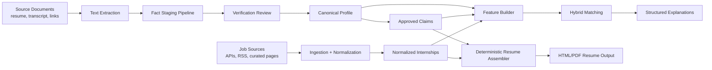

# CareerOS Architecture V2

## 1. Purpose

This document replaces the original architecture as the implementation target for the MVP.

The revised architecture keeps the original product direction but removes unnecessary complexity and closes the biggest safety gaps:

- claim-level verification instead of record-level verification
- a real fact staging pipeline between extraction and canonical profile data
- resume generation from approved claims only
- localhost-secure defaults
- no mandatory worker container in MVP
- a deterministic normalization layer before embedding-based ranking
- explicit embedding invalidation and recomputation rules

This version is intentionally MVP-focused. It does not introduce new infrastructure unless the existing stack cannot support the requirement.

## 2. Design Principles

### 2.1 Structured Profile Remains The Source Of Truth

Career data lives in PostgreSQL as structured records. Resumes are inputs and outputs, not canonical state.

### 2.2 Trust At The Claim Level

The unit of truth is an atomic approved claim, not a whole experience or project record.

Examples of claims:

- "Built a CNN image classifier in PyTorch"
- "Improved model accuracy from 81% to 89%"
- "Used FastAPI and PostgreSQL in a backend project"

This is the minimum level of granularity needed to keep resume generation safe.

### 2.3 Stage Before Accepting

AI-extracted facts must enter a staging area first. Nothing extracted by AI should become canonical profile data without review or an explicit promotion rule.

### 2.4 Deterministic Before Generative

Prefer deterministic normalization, ranking, and resume assembly. Use AI to extract, classify, embed, and polish explanations only where it adds clear value.

### 2.5 Localhost-Secure By Default

The MVP is local-first, but that does not mean insecure. The default deployment should bind to localhost, require local credentials, and minimize sensitive logging.

### 2.6 Operational Simplicity

The MVP should run with:

1. `api`
2. `db`
3. `local-ai` optional

Background work can be triggered synchronously, through FastAPI background tasks, or through explicit CLI commands. A dedicated `worker` container is not required for MVP.

## 3. Revised MVP Architecture



## 4. Core Components

### 4.1 API Service

Responsibilities:

- document upload
- extraction requests
- profile review and approval actions
- internship retrieval
- match recomputation triggers
- resume generation

The API should support small jobs inline and defer longer jobs to FastAPI background tasks or CLI commands.

### 4.2 Fact Staging Pipeline

This is the most important addition in V2.

Stages:

1. extract raw text from document
2. run structured extraction into candidate facts
3. split candidate facts into atomic claim candidates
4. attach evidence spans from source text
5. validate candidate structure
6. present for approval, rejection, or edit
7. promote approved items into canonical profile data and approved claims

Key rule:

AI may propose facts and claims, but only the verification layer may approve them for downstream use.

### 4.3 Canonical Profile

The canonical profile stores durable structured entities:

- education
- experience
- projects
- certifications
- links
- normalized skills
- preferences

These entities are supported by approved claims rather than loosely trusted free text.

### 4.4 Approved Claims Store

Approved claims are the only text fragments eligible for tailored resume output.

Each approved claim must carry:

- source document reference
- evidence span or provenance link
- owning entity reference
- verification timestamp
- verification actor

This store is the direct safety boundary for resume generation.

### 4.5 Internship Ingestion And Normalization

Internship ingestion remains a curated adapter system, but V2 adds a first-class normalization layer before matching.

Normalization responsibilities:

- normalize skill names against canonical skill aliases
- normalize role titles into target categories
- normalize location and work mode
- normalize company domains and URLs
- compute dedupe fingerprints

### 4.6 Hybrid Matching

Matching should run in this order:

1. hard filters
2. deterministic normalized feature scoring
3. shortlist generation
4. embedding rerank
5. structured explanation assembly

This keeps embeddings useful without letting them dominate low-quality input data.

### 4.7 Deterministic Resume Assembler

Resume generation in MVP should not let the LLM freely write bullets.

The resume assembler should:

1. choose the target internship
2. select relevant approved claims only
3. group claims by section
4. apply deterministic templates
5. render HTML
6. export PDF

Optional AI usage:

- help rank relevant approved claims
- help classify claims by topic
- optionally polish explanation text outside the resume artifact

Not allowed in MVP:

- inventing new bullets
- merging multiple claims into a stronger unsupported claim
- adding metrics or technologies not present in approved claims

## 5. MVP Runtime Topology

### 5.1 Required Containers

1. `api`
2. `db`

### 5.2 Optional Container

1. `local-ai`

### 5.3 No Mandatory Worker Container

The MVP should not require a dedicated worker container.

Allowed execution patterns:

- inline synchronous processing for short jobs
- FastAPI background tasks for moderate jobs
- explicit CLI commands for batch maintenance:
  - `extract_profile`
  - `sync_internships`
  - `recompute_matches`
  - `rebuild_embeddings`

When a dedicated worker becomes necessary later, it should reuse the same application package and task models rather than introducing a new platform.

## 6. Localhost-Secure Defaults

The default Compose and application configuration should enforce:

- API bound to `127.0.0.1`
- PostgreSQL bound to `127.0.0.1`
- no hardcoded production-like secrets in Compose
- environment-based credentials loaded from `.env`
- local API token or session secret even in single-user mode
- raw documents stored outside any public static path
- sensitive fields excluded from default API serialization
- raw document text excluded from logs
- model prompts and outputs logged only in redacted or debug-only form

Recommended default posture:

- trusted single user
- untrusted local network
- no assumption that localhost services are private if bound incorrectly

## 7. Updated Database Schema

## 7.1 Schema Strategy

The schema now separates:

1. raw inputs
2. staged extracted candidates
3. approved canonical entities
4. approved claims
5. normalized jobs
6. derived matching artifacts

This is the minimum structure needed to support truthful resume generation and safe iteration.

## 7.2 Core Enums

Recommended enums:

- `verification_status`: `pending`, `approved`, `rejected`, `edited`
- `claim_status`: `pending`, `approved`, `rejected`, `retired`
- `candidate_kind`: `education`, `experience`, `project`, `skill`, `certification`, `link`, `claim`
- `document_type`: `resume`, `transcript`, `certificate`, `portfolio`, `manual_note`, `other`
- `source_type`: `api`, `rss`, `scraper`, `manual`
- `work_mode`: `onsite`, `hybrid`, `remote`, `unknown`
- `job_status`: `active`, `closed`, `expired`, `unknown`
- `extraction_status`: `queued`, `running`, `succeeded`, `failed`
- `resume_status`: `draft`, `approved`, `exported`
- `source_policy_status`: `allowed`, `review_needed`, `disabled`

## 7.3 Identity And Profile Tables

### `users`

| Column | Type | Notes |
|---|---|---|
| id | uuid pk | |
| email | text unique nullable | |
| display_name | text | |
| timezone | text | |
| api_token_hash | text nullable | local auth token hash |
| created_at | timestamptz | |
| updated_at | timestamptz | |

### `profiles`

| Column | Type | Notes |
|---|---|---|
| id | uuid pk | |
| user_id | uuid fk users.id | |
| headline | text nullable | |
| summary | text nullable | user-authored only |
| target_roles | jsonb | |
| target_locations | jsonb | |
| work_preferences | jsonb | |
| created_at | timestamptz | |
| updated_at | timestamptz | |

### `source_documents`

| Column | Type | Notes |
|---|---|---|
| id | uuid pk | |
| user_id | uuid fk users.id | |
| document_type | document_type | |
| file_name | text | |
| storage_path | text | local storage path |
| sha256 | text | |
| extracted_text | text nullable | restricted access |
| metadata_json | jsonb | parser metadata |
| created_at | timestamptz | |

## 7.4 Fact Staging Tables

### `extraction_runs`

Tracks each extraction attempt over a document or linked source.

| Column | Type | Notes |
|---|---|---|
| id | uuid pk | |
| source_document_id | uuid fk source_documents.id | |
| status | extraction_status | |
| model_name | text nullable | |
| prompt_version | text nullable | |
| input_sha256 | text | |
| output_json | jsonb nullable | raw structured model output |
| error_message | text nullable | |
| started_at | timestamptz | |
| completed_at | timestamptz nullable | |

### `fact_candidates`

Staged extracted items before promotion into canonical tables.

| Column | Type | Notes |
|---|---|---|
| id | uuid pk | |
| extraction_run_id | uuid fk extraction_runs.id | |
| profile_id | uuid fk profiles.id | |
| candidate_kind | candidate_kind | |
| parent_candidate_id | uuid fk fact_candidates.id nullable | groups related items |
| structured_data | jsonb | typed candidate payload |
| status | verification_status | |
| reviewer_notes | text nullable | |
| created_at | timestamptz | |
| reviewed_at | timestamptz nullable | |

### `fact_evidence_spans`

Links candidates and claims back to exact source text spans.

| Column | Type | Notes |
|---|---|---|
| id | uuid pk | |
| source_document_id | uuid fk source_documents.id | |
| fact_candidate_id | uuid fk fact_candidates.id nullable | |
| source_text_start | integer | character offset |
| source_text_end | integer | character offset |
| snippet_text | text | short supporting snippet |
| confidence_score | numeric(5,2) nullable | |
| created_at | timestamptz | |

### `verification_events`

Immutable review log.

| Column | Type | Notes |
|---|---|---|
| id | uuid pk | |
| fact_candidate_id | uuid fk fact_candidates.id nullable | |
| approved_claim_id | uuid fk approved_claims.id nullable | |
| actor_user_id | uuid fk users.id | |
| action | text | approve, reject, edit, retire |
| notes | text nullable | |
| created_at | timestamptz | |

## 7.5 Canonical Profile Tables

### `education_records`

| Column | Type | Notes |
|---|---|---|
| id | uuid pk | |
| profile_id | uuid fk profiles.id | |
| institution_name | text | |
| degree | text | |
| field_of_study | text | |
| start_date | date nullable | |
| end_date | date nullable | |
| gpa | numeric(4,2) nullable | |
| location | text nullable | |
| created_at | timestamptz | |
| updated_at | timestamptz | |

### `experience_records`

Keep these factual and low-interpretation. Do not store resume-ready generated bullets here.

| Column | Type | Notes |
|---|---|---|
| id | uuid pk | |
| profile_id | uuid fk profiles.id | |
| organization_name | text | |
| role_title | text | |
| employment_type | text | |
| start_date | date nullable | |
| end_date | date nullable | |
| is_current | boolean | |
| location | text nullable | |
| created_at | timestamptz | |
| updated_at | timestamptz | |

### `project_records`

| Column | Type | Notes |
|---|---|---|
| id | uuid pk | |
| profile_id | uuid fk profiles.id | |
| name | text | |
| project_type | text | |
| repo_url | text nullable | |
| demo_url | text nullable | |
| start_date | date nullable | |
| end_date | date nullable | |
| created_at | timestamptz | |
| updated_at | timestamptz | |

### `certifications`

| Column | Type | Notes |
|---|---|---|
| id | uuid pk | |
| profile_id | uuid fk profiles.id | |
| name | text | |
| issuer | text | |
| issued_at | date nullable | |
| expires_at | date nullable | |
| credential_url | text nullable | |
| created_at | timestamptz | |
| updated_at | timestamptz | |

### `profile_links`

| Column | Type | Notes |
|---|---|---|
| id | uuid pk | |
| profile_id | uuid fk profiles.id | |
| link_type | text | |
| url | text | |
| label | text nullable | |
| created_at | timestamptz | |
| updated_at | timestamptz | |

## 7.6 Claims And Skill Tables

### `approved_claims`

This table is the direct input to resume generation.

| Column | Type | Notes |
|---|---|---|
| id | uuid pk | |
| profile_id | uuid fk profiles.id | |
| owning_entity_type | text | experience, project, education, certification, summary |
| owning_entity_id | uuid nullable | |
| claim_text | text | approved text only |
| claim_type | text | achievement, responsibility, skill-use, summary, metric |
| status | claim_status | |
| source_document_id | uuid fk source_documents.id | |
| source_primary_span_id | uuid fk fact_evidence_spans.id nullable | |
| approved_from_candidate_id | uuid fk fact_candidates.id nullable | |
| approved_at | timestamptz | |
| retired_at | timestamptz nullable | |
| created_at | timestamptz | |
| updated_at | timestamptz | |

### `skill_catalog`

| Column | Type | Notes |
|---|---|---|
| id | uuid pk | |
| name | text unique | canonical skill |
| category | text | |
| created_at | timestamptz | |

### `skill_aliases`

Normalization layer for raw and variant spellings.

| Column | Type | Notes |
|---|---|---|
| id | uuid pk | |
| skill_id | uuid fk skill_catalog.id | |
| alias | text unique | |
| normalization_source | text | manual, rules, extraction |
| created_at | timestamptz | |

### `profile_skills`

Only store skills supported by approved evidence.

| Column | Type | Notes |
|---|---|---|
| id | uuid pk | |
| profile_id | uuid fk profiles.id | |
| skill_id | uuid fk skill_catalog.id | |
| evidence_claim_id | uuid fk approved_claims.id nullable | |
| proficiency_level | smallint nullable | optional |
| last_used_at | date nullable | |
| created_at | timestamptz | |
| updated_at | timestamptz | |

### `claim_skills`

Links individual approved claims to normalized skills.

| Column | Type | Notes |
|---|---|---|
| claim_id | uuid fk approved_claims.id | composite key |
| skill_id | uuid fk skill_catalog.id | composite key |

## 7.7 Internship Source, Normalization, And Job Tables

### `internship_sources`

| Column | Type | Notes |
|---|---|---|
| id | uuid pk | |
| name | text unique | |
| source_type | source_type | |
| base_url | text | |
| is_active | boolean | |
| created_at | timestamptz | |

### `source_policies`

Minimal source governance without new infrastructure.

| Column | Type | Notes |
|---|---|---|
| id | uuid pk | |
| source_id | uuid fk internship_sources.id unique | |
| policy_status | source_policy_status | |
| robots_checked_at | timestamptz nullable | |
| terms_reviewed_at | timestamptz nullable | |
| rate_limit_notes | text nullable | |
| notes | text nullable | |
| updated_at | timestamptz | |

### `ingestion_runs`

| Column | Type | Notes |
|---|---|---|
| id | uuid pk | |
| source_id | uuid fk internship_sources.id | |
| started_at | timestamptz | |
| completed_at | timestamptz nullable | |
| status | extraction_status | |
| items_seen | integer | |
| items_created | integer | |
| items_updated | integer | |
| error_message | text nullable | |
| metadata_json | jsonb | |

### `raw_postings`

| Column | Type | Notes |
|---|---|---|
| id | uuid pk | |
| source_id | uuid fk internship_sources.id | |
| external_id | text nullable | |
| source_url | text | |
| payload_json | jsonb | |
| content_hash | text | |
| fetched_at | timestamptz | |

### `normalized_titles`

| Column | Type | Notes |
|---|---|---|
| id | uuid pk | |
| canonical_title | text unique | |
| role_family | text | ml, ai, data, swe |
| created_at | timestamptz | |

### `title_aliases`

| Column | Type | Notes |
|---|---|---|
| id | uuid pk | |
| normalized_title_id | uuid fk normalized_titles.id | |
| alias | text unique | |
| created_at | timestamptz | |

### `normalized_locations`

| Column | Type | Notes |
|---|---|---|
| id | uuid pk | |
| country | text nullable | |
| city | text nullable | |
| region | text nullable | |
| work_mode | work_mode | |
| canonical_label | text unique | |
| created_at | timestamptz | |

### `internships`

| Column | Type | Notes |
|---|---|---|
| id | uuid pk | |
| source_id | uuid fk internship_sources.id | |
| raw_posting_id | uuid fk raw_postings.id | latest raw payload |
| title | text | raw title |
| normalized_title_id | uuid fk normalized_titles.id nullable | |
| company_name | text | |
| company_domain | text nullable | |
| description | text | |
| requirements | text nullable | |
| responsibilities | text nullable | |
| application_url | text | |
| location_text | text nullable | |
| normalized_location_id | uuid fk normalized_locations.id nullable | |
| posted_at | timestamptz nullable | |
| expires_at | timestamptz nullable | |
| status | job_status | |
| dedupe_key | text | |
| content_hash | text | |
| created_at | timestamptz | |
| updated_at | timestamptz | |

### `internship_skill_requirements`

| Column | Type | Notes |
|---|---|---|
| id | uuid pk | |
| internship_id | uuid fk internships.id | |
| skill_id | uuid fk skill_catalog.id nullable | |
| skill_name_raw | text | |
| requirement_strength | smallint | |
| is_required | boolean | |
| extraction_method | text | rules, llm, manual |
| created_at | timestamptz | |

## 7.8 Embeddings And Invalidation Tables

### `entity_embeddings`

The embedding store remains in PostgreSQL with `pgvector`, but V2 adds explicit invalidation fields.

| Column | Type | Notes |
|---|---|---|
| id | uuid pk | |
| entity_type | text | approved_claim, internship |
| entity_id | uuid | |
| content_hash | text | hash of embedded text |
| model_name | text | |
| embedding_version | text | model plus preprocessing version |
| embedding | vector(<EMBED_DIM>) | |
| is_active | boolean | |
| invalidated_at | timestamptz nullable | |
| invalidation_reason | text nullable | |
| created_at | timestamptz | |

Recommended rules:

- embed approved claims, not free-form experience summaries
- embed internships using normalized text payload
- on text change, model change, or normalization change, mark old rows inactive and create new rows
- never silently overwrite prior embeddings

### `embedding_rebuild_queue`

This is a lightweight database table, not a separate queueing system.

| Column | Type | Notes |
|---|---|---|
| id | uuid pk | |
| entity_type | text | |
| entity_id | uuid | |
| reason | text | content_changed, model_changed, alias_changed |
| queued_at | timestamptz | |
| processed_at | timestamptz nullable | |

## 7.9 Matching Tables

### `match_runs`

| Column | Type | Notes |
|---|---|---|
| id | uuid pk | |
| profile_id | uuid fk profiles.id | |
| scoring_version | text | |
| embedding_version | text | |
| started_at | timestamptz | |
| completed_at | timestamptz nullable | |
| status | extraction_status | |

### `internship_matches`

| Column | Type | Notes |
|---|---|---|
| id | uuid pk | |
| match_run_id | uuid fk match_runs.id | |
| profile_id | uuid fk profiles.id | |
| internship_id | uuid fk internships.id | |
| total_score | numeric(5,2) | |
| hard_filter_passed | boolean | |
| normalized_feature_score | numeric(5,2) | |
| semantic_score | numeric(5,2) | |
| skill_score | numeric(5,2) | |
| experience_score | numeric(5,2) | |
| preference_score | numeric(5,2) | |
| gap_penalty | numeric(5,2) | |
| explanation_json | jsonb | structured only |
| created_at | timestamptz | |

### `skill_gap_items`

| Column | Type | Notes |
|---|---|---|
| id | uuid pk | |
| internship_match_id | uuid fk internship_matches.id | |
| skill_id | uuid fk skill_catalog.id nullable | |
| skill_name_raw | text | |
| severity | smallint | |
| reason | text | |
| recommendation | text nullable | |
| created_at | timestamptz | |

## 7.10 Resume Output Tables

### `resume_templates`

| Column | Type | Notes |
|---|---|---|
| id | uuid pk | |
| name | text unique | |
| template_engine | text | jinja2 |
| template_path | text | |
| is_active | boolean | |
| created_at | timestamptz | |

### `generated_resumes`

| Column | Type | Notes |
|---|---|---|
| id | uuid pk | |
| profile_id | uuid fk profiles.id | |
| internship_id | uuid fk internships.id nullable | |
| template_id | uuid fk resume_templates.id | |
| status | resume_status | |
| rendered_html_path | text nullable | |
| rendered_pdf_path | text nullable | |
| created_at | timestamptz | |

### `generated_resume_claims`

Traceability is now claim-level rather than section-level only.

| Column | Type | Notes |
|---|---|---|
| id | uuid pk | |
| generated_resume_id | uuid fk generated_resumes.id | |
| approved_claim_id | uuid fk approved_claims.id | |
| section_name | text | |
| display_order | integer | |
| rendered_text | text | should match or be a constrained formatting variant |
| created_at | timestamptz | |

## 7.11 Recommended Indexes

- `source_documents(sha256)`
- `fact_candidates(profile_id, status, candidate_kind)`
- `fact_evidence_spans(source_document_id)`
- `approved_claims(profile_id, status, owning_entity_type)`
- `approved_claims(source_document_id)`
- `skill_aliases(alias)`
- `title_aliases(alias)`
- `normalized_locations(canonical_label)`
- `internships(dedupe_key)`
- `internships(status, posted_at desc)`
- `internships(normalized_title_id, normalized_location_id)`
- `internship_skill_requirements(internship_id)`
- `entity_embeddings(entity_type, entity_id, is_active)`
- vector index on `entity_embeddings.embedding`
- `embedding_rebuild_queue(processed_at, queued_at)`
- `internship_matches(profile_id, total_score desc)`
- `generated_resume_claims(generated_resume_id, display_order)`

## 8. Matching And Normalization Strategy

## 8.1 Normalization First

Before embeddings are used:

- raw skill mentions should be resolved through `skill_aliases`
- raw titles should be resolved through `title_aliases`
- raw location strings should be resolved through `normalized_locations`

If normalization fails, preserve the raw value and flag it for review rather than forcing a low-confidence mapping.

## 8.2 Match Scoring

Recommended MVP formula:

```text
total_score =
  hard_gate_multiplier *
  (
    0.40 * normalized_feature_score +
    0.25 * semantic_score +
    0.20 * skill_score +
    0.15 * experience_score
  )
  - gap_penalty
```

Notes:

- deterministic normalized matching gets the highest weight
- embeddings rerank rather than define the whole ranking
- preference fit can be folded into normalized features in MVP

## 8.3 Explanations

Explanation generation should start from structured facts:

- matched skills
- matched approved claims
- location and work-mode fit
- missing required skills

LLM polishing is optional and must not introduce unsupported facts.

## 9. Embedding Invalidation Strategy

Embeddings should be invalidated when any of the following changes:

1. approved claim text changes
2. internship description or requirements change
3. normalization output changes
4. embedding model changes
5. chunking or preprocessing rules change

Invalidation process:

1. mark old embedding rows `is_active = false`
2. set `invalidated_at`
3. record `invalidation_reason`
4. enqueue rebuild in `embedding_rebuild_queue`
5. create new embedding row after recomputation

This preserves auditability and avoids hidden stale vectors.

## 10. API And CLI Surface

Recommended MVP endpoints:

- `GET /health`
- `POST /documents/upload`
- `POST /documents/{id}/extract`
- `GET /profiles/{profile_id}`
- `GET /profiles/{profile_id}/fact-candidates`
- `POST /fact-candidates/{id}/approve`
- `POST /fact-candidates/{id}/reject`
- `POST /fact-candidates/{id}/edit-and-approve`
- `GET /internships`
- `POST /sources/{source_id}/sync`
- `POST /matches/recompute`
- `GET /matches`
- `POST /resumes/generate`
- `GET /resumes/{resume_id}`

Recommended MVP CLI commands:

- `extract_profile`
- `sync_internships`
- `recompute_matches`
- `rebuild_embeddings`

## 11. Implementation Summary

The V2 MVP architecture is:

- a modular monolith
- running with API plus PostgreSQL by default
- optionally using a local model container
- enforcing fact staging before canonical promotion
- enforcing claim-level verification
- generating resumes from approved claims only
- using deterministic normalization before embedding reranking
- handling embedding invalidation explicitly inside PostgreSQL

This is a stricter and smaller architecture than V1. It is better aligned with the product’s non-hallucination requirement and avoids operational complexity that the MVP does not yet need.
